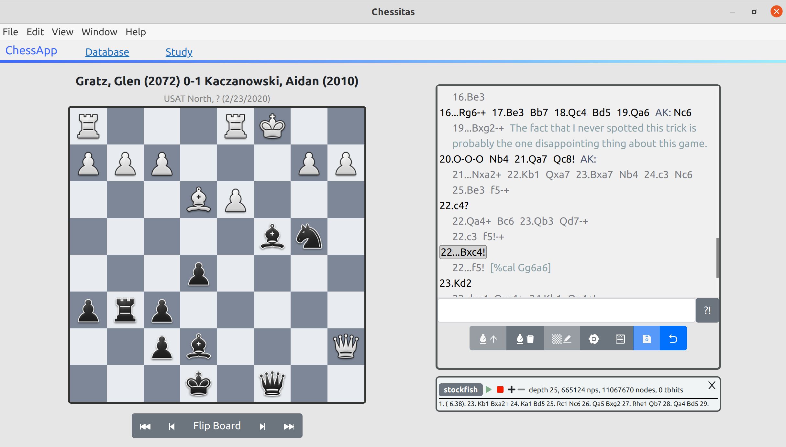
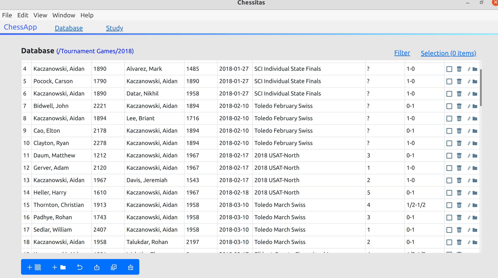

# Chessitas

All in one chess database and study tool. Enables you to annotate games, perform engine analysis, manage and train opening variations,
practice tactics, and more without relying on a 3rd-party platform like chess.com or lichess.

## Features
- Game database
  - Enter and annotate chess games with side variations, text, and annotation symbols
  - Organize and search chess games
  - Import and export games from PGN
  - Replay the games with engine analysis using any UCI chess engine
- Study Tool
  - Quiz yourself on opening preparation, or practice solving tactical puzzles.
  - Customize your study sessions by handpicking which variations to study and how deep to go.
  - Review your accuracy and speed in previous study sessions and try to improve
  - Track the positions and files where you have the most difficulty

The game editor with annotations and engine analysis.

The database resembles a file system with folders, games, openings, and puzzles. This view shows a list of games in the 2018 folder which can be filtered.
